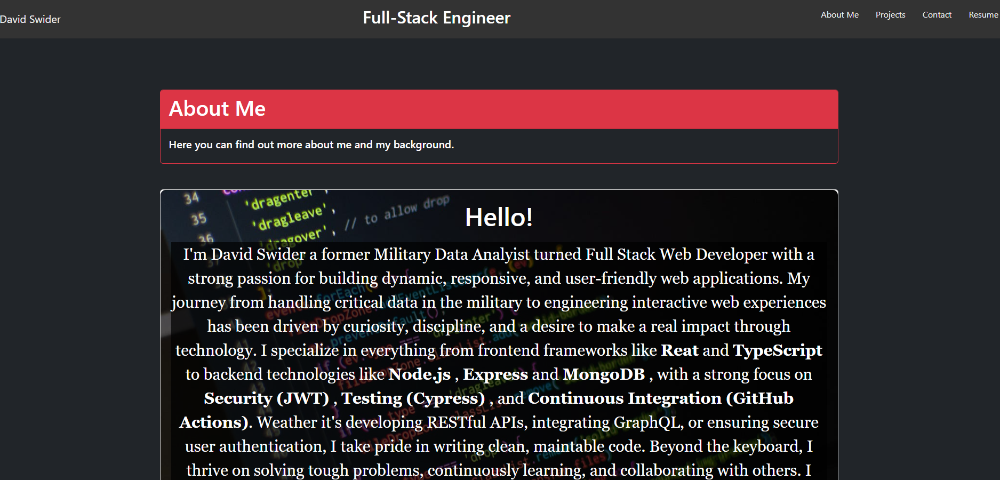

# 👋 David Swider's Developer Portfolio

Welcome to my personal portfolio site! This project showcases my journey from a Military Data Analyst to a Full Stack Web Developer. Built with modern technologies, it highlights my skills, projects, and experiences.

## 🌐 Live Demo

Check out the live site here: [https://swiderportfolio.netlify.app/resume](#)

## 🛠️ Tech Stack

- **Frontend:** React, Vite, Tailwind CSS
- **Backend:** Node.js, Express.js
- **Authentication:** JSON Web Tokens (JWT)
- **Database:** MongoDB with Mongoose
- **Testing:** Cypress
- **CI/CD:** GitHub Actions
- **Deployment:** Render

## 🚀 Features

- **Responsive Design:** Optimized for all devices.
- **Project Showcase:** Detailed view of my projects with links to repositories.
- **Authentication:** Secure login system using JWT.
- **Contact Form:** Reach out to me directly through the site.
- **Automated Testing:** Ensures reliability with Cypress tests.
- **Continuous Deployment:** Seamless updates via GitHub Actions and Render.

## 📸 Screenshots




## 🧪 Running Locally

1. **Clone the repository:**
   ```bash
   git clone https://github.com/DavidSwider/MyPortfolio.git
   cd MyPortfolio

## 📬 Contact Me

- 📧 **Email:** [davidswider6@gmail.com](mailto:davidswider6@gmail.com)  
- 💼 **LinkedIn:** [linkedin.com/in/david-swider-4a3](https://www.linkedin.com/in/david-swider-4a3)  
- 💻 **GitHub:** [github.com/DavidSwider](https://github.com/DavidSwider)  
- 🌐 **Portfolio Website:** [https://swiderportfolio.netlify.app/resume](#)
